# FriendFinderSFU
A friend-finding (and more!) app dedicated to the SFU community. CMPT 276 group projects 3.

## Table of Contents

- Abstract
- The problem our App solves
- Currently available solutions
- Customers' needs
- Target Audience
- Competitve Analysis
- Our app's value
- List of Epics
- Group members
- Citations and Acknowledgements
- Iteration 1 Notes
- **User Stories and Use Cases**
- **User Interface Requirements**

## Abstract

Our app is a hybrid and innovative university-specific social app which acts as a dating app, a friend finding app, and an academic study buddy (study partner) app. Specifically, users will have the option to use any of these features by creating profiles customized for each, and then getting matched to other users who share their interests or meet their specified criteria.

## The problem our App solves

Meeting people in a large university is a challenge for everyone, especially new students. New students (and sometimes even upper-year students) often have to meet lots of people before they find their community, which in itself can be difficult and at times very awkward. While all universities have this problem to some extent, SFU in particular is famous for having a poor social environment.

Our app is designed to help mitigate this problem by providing an easy, fast, and organized way to meet people within the university, whether it be for making new friends, finding a romantic partner, or finding a study buddy.

## Currently Available Solutions

The closest existing public-facing solution is **Bumble**[1], which is a hybrid dating/friendship app. It has features such as friend-finding, dating, and clubs. There are many other dating apps as well, mostly focusing on dating. There are also some university-specific solutions such as **College Mixer** for Western University[2]. However, most of these solutions focus solely on dating, and not friendships or non-romantic relationships.

## Customers’ Needs (projected)

1. An easy and fast way to meet new friends, study buddies, or romantic partners online within the university.  
2. A way to find people who share their interests (and possibly preferences), which can be difficult in a large university or for people with niche hobbies and interests.  
3. A way to stay safe from dating-app-related online threats, such as harassment and “catfishing”.  
4. A secure communication channel with potential new friends or partners which is exclusive to a trusted community (university community) and minimizes risks of online harassment.

## Target Audience

Our app is exclusively targeted toward **SFU students**, with the possibility of having versions for other universities as well in the future. We will focus on single-university instances of the application (no cross-university memberships) since the goal is for students to form lasting friendships and relationships within their home university. There are also potential security advantages with this approach as users will have to prove their student status, which both puts an initial filter on potential bad actors and enables additional resources (for example the university board of student conduct) in case issues occur.

## Competitive Analysis (SWOT)

Strengths:

1. Our app will be developed by SFU students, for SFU students, boosting acceptance and fitness to the task as we can relate to many issues students face.  
2. If connected to SFU’s CAS server, our app needs very little support/maintenance to function.  
3. Our app will be using the SFU computing id and email so it should limit spam accounts and catfishing.

Weaknesses:

1. Our app would need lots of users to be potentially profitable as a SaaS.  
2. Our app would be accessible on web only in the first release (most dating apps have mobile versions)  
3. Compared to social media which has a lot more features and a larger user group, our app will need to start from zero.

Opportunities:

1. There are no direct competitors within the SFU community (and many other universities)  
2. There is an atmosphere of risk in public opinion around public-facing dating apps.

Threats:

1. Public-facing dating apps have been around for a long time and already have many users.  
2. The study buddy finding feature in our app is very new, with little data on whether it will be met with enthusiasm by university students in the context of a larger social app.

## Our App’s Value

Our app provides near equal focus on romantic relationships, friendships, and study buddies among university students. Most similar apps focus on dating only, which ignores the growing needs for social community finding specially for new students.

Additionally, our app provides a host of features such as deterministic (score based) matching, text chats, voice and video calls, event/date planning, and more, to meet the needs of all users.

## List of Main Epics/Features (small changes made in iteration2/3)

- Profiles and Questionnair: Three-part interleaved profile built using a comprehensive questionnair, divided into general questions and three specialized parts (dating, friendship, study buddies) with the possibility of disabling each part. Includes questions about interests, preferences, and academic experiences.
- Feeds: Allow users to see profiles matched to their profile and send expressions of interest. Suggestions in feeds will be given based on matching score calculation algorithms dedicated to each profile/stream.
- Chat and virtual meeting features: Individual chats with security features (e.g., blocking, no media/photo sharing) and voice/video calls (using **Zoom REST API**)  
  - APIs will be used to obtain meeting join links once a user initiates or joins a call
- Login and CAS Integration: app allows logging in with a CAS server (with the ultimate goal being the SFU CAS server), using a username and password, or both.  
- Groups: Users will be able create groups using matching features (with a small questionnair dedicated to groups), as well as manually creating groups and exploring and joining existing groups using a matching-score ordered groups list/feed. Group members can chat using dedicated group chats.
- Course Ratings: A simple ratings sytem where users can submit 1-5 ratings for recent SFU courses
  - **Uses SFU Outlines REST API to validate entered courses and pull full course titles**

## Group Members and Expertise

- David (left team July 3rd, 2026) 
  - 2nd-year Computer Science student.  
  - Familiar with C++. and Java.  
  - Comfortable with backend development

- Parsa  
  - 2nd-year Computer Science student at Simon Fraser University.  
  - Experienced with Python and familiar with C, C++, Haskell, and Java.  
  - Comfortable with both frontend and backend development.  
  - Strong interest in frontend development and user interface design.  
      
- Pravit  
  - Second-year Computer Science student at Simon Fraser University with hands-on experience in full-stack development, machine learning, and software testing. Proficient in Python, Java, JavaScript, and SQL with practical experience building production-grade ML pipelines (PyTorch, scikit-learn, Pandas) and modern web apps (React, Next.js, FastAPI, Flask, Streamlit).   
      
- Taha  
  - 1st year CS student  
  - Some experience with PHP and Django  
  - Proficient in Java, C++, and Python  

- William  
  - 3rd year SOSY student  
  - Main coding language is C++, experience in Python, Java, SQL  
  - Preference for backend coding

## Works Cited (this file)

[1] M. Zhao, “Review: Swiping right on College Mixer, the dating app for Western students,” *The Gazette • Western University’s Student Newspaper*, Feb. 12, 2024\. https://westerngazette.ca/culture/student\_life/review-swiping-right-on-college-mixer-the-dating-app-for-western-students/article\_c73dce46-c9c2-11ee-90c4-27de88c99ac6.html (accessed Jun. 19, 2026).  
[2]	Bumble, “Bumble \- Date, Meet, Network Better,” *Bumble*, 2023\. https://bumble.com/ (accessed Jun. 19, 2026).  

## Other Project Acknowledgements
See `docs/DECLARATIONS.md` in project repository

## Meeting Notes
See `docs/meeting-notes` in project repository

# Iteration Reflections
## Iteration 1

- Total story points completed: 21
- Average velocity: 10.5 points/week
- Week 1 velocity: 0 points/week (spent setting up templates, models, etc)
- Week 2 velocity: 21 points/week

**Process Improvement**
- We did too much of the work in the second half of the iteration, which led to a high workload towards the end.
- Having different people do different parts of the same feature (e.g., template and controller) led to inconsistencies and issues and was avoided in iteration 2.
- We did not review PRs very thoroughly (primairly because of the first point) which led to errors being pushed to main in two occasions. This was avoided in iteration 2.

## Iteration 2

- Total story points completed: 20
- Average Velocity: 10 points/week

**Process Improvement**
- We did not divide controllers and templates for features between more than 1 person, and our development went a lot more smootly.
- Our pace was a bit better (still with room for improvement)
- No considerable bugs or errors made it to `main` in this iteration (unlike iteration 1)

  
## Iteration 3

- Total story points completed: 28
- Average Velocity: 14 points/week

**Process Improvement**
- We did a more logical dividing of tasks in iteration 3 compared to iterations 2 and 1
- We were clearer in communication in Iteration 3

# User Stories

**Colors: blue-iteration 1, green-iteration 2, red-iteration 3**

## Case: Auth-wall (1 point)
**Iteration**
Completed in Iteration 1.

**Personas/Actors**
1. Primary actor: Jane - a random person

**Pre-conditions**
None

**Actions/Triggers**
Jane attempts to go to the app's dashboard or other authenticated page by opening the app URL.

**Acceptance Criteria**
- If Jane has an active session (has logged in before), she must be able to view the dashboard or requested page
- If Jane has not yet logged in, she should be redirected to the login page

**Post-conditions**
- If Jane has not logged in, she should not be served any protected information from the database (other users' profiles, etc)

**Non-functional requirements**
- An average user should be able to understand why they have been redirected to the login page through the UX
- All pages should load in less than one second

**Tests**
- An unauthenticated user sending a request to the application root (dashboard) should be redirected to `/login`
- An authenticated user sending a request to the application root should get a 200-level result code and should not be redirected.

## Case: Sign-up (3 points)
**Iteration**
Completed in Iteration 1.

**Personas/Actors**
1. Primary actor: Mike - Second-year SFU student looking to meet new friends
2. Secondary actor: Jane - Second-year SFU student already using the app to find new friends

**Pre-conditions**
- Jane must have an existing account in the App

**Actions/Triggers**
Mike opens the app URL and must be redirected to the login page. Then, he clicks the sign-up link in the login page and is redirected to the sign-up page where he is asked for his first and last name, email address, a chosen password repeated twice, and his gender. He is also asked to accept the terms of use.

Mike then enters his information and clicks Submit to create his account.

**Acceptance Criteria**
- If Mike enters any string as their first and last name, a valid and not previously used valid email address, matching passwords in the two password fields, a valid dropdown item for gender, and accepts the terms of use by checking the applicable checkbox, then his account must be registered and he must be redirected to the login page with a success message.
- If any of the fields are left empty once the form is submitted, mike should be redirected back to the signup page with an error message
- If Mike enters an invalid email, or enters Jane's email (or any already registered user's email), then he should be redirected back to the signup page with an error message

**Post-conditions**
- If Mike's input is accepted, then a database record of his new account must be created.
- Otherwise, no new records should be entered in the database

**Non-functional requirements**
- New passwords should be hashed prior to being saved
- All pages should load in less than one second

**Tests**
- The input {Mike, Brown, mike@sfu.ca, 1234, 1234, male, true} should result in a record creation and redirection to the sign-in page with a success message.
- An input missing the last name field should be rejected and redirected back to the sign-up page with an error message
- Using Jane's email address with the first test scenario should be rejected and redirected back to the sign-up page with an error message
- Using the email address "mikesfuca" in the first test scenario be rejected and redirected back to the sign-up page with an error message

## Case: Log in (2 points)
**Iteration**
Completed in Iteration 1.

**Personas/Actors**
1. Primary actor: John - a Second-year SFU student

**Pre-conditions**
- John must have an existing account in the app

**Actions/Triggers**
John opens the app URL, and is redirected to the login page with two inputs: email and password, as well as a Log in button. 

He then enters his username and password and clicks on the Log in button.

**Acceptance Criteria**
- If John uses the email and password associated with his account correctly, he should be redirected to the dashboard page
- If John enters the wrong password, he should be redirected back to the login page with an error message
- If John enters the wrong email address, or both a wrong email address and the wrong password, then he should be redirected back to the login page with an error message.

**Post-conditions**
- If John logs in successfully, his session variables must reflect his user ID.
- If John's login attempt is unsuccessful, then his session variables should not be modified.

**Non-functional requirements**
- All pages should load in less than one second

**Tests**
- The correct email address and password should produce a redirect to the dashboard page, and result in a session variable creation
- Any of wrong password, wrong email, or both, should result redirection back to the login page. No session variable should be set.
- Empty email, password or both should stop login attempt and display a message notifying the user that the fields should not be empty. No session variable should be set.

## Case: Dashboard Loading (2 points)
**Iteration**
Completed in Iteration 1.

**Personas/Actors**
1. Primary actor: John - a Second-year SFU student

**Pre-conditions**
- John must have an existing account in the app

**Actions/Triggers**
John logs into the app and is redirected to the dashboard page, or clicks on the dashboard link in the app menu from any page in the app, or opens the base URL of the app

**Acceptance Criteria**
- If John is not signed in, then he should be redirected to the login page
- If John is signed in and is a regular user, then he should see a dashboard consisting of his basic user information and options to view his profile or change his account details
- If John is a moderator or an admin, then he should see a dashboard which, in addition to the above, contains a banner stating his role at the top of the page as well as a menu item for the admin panel.

**Post-conditions**
- None

**Non-functional requirements**
- All pages should load in less than one second
- Admins and moderators should be able to get to the admin panel from the dashboard in one click without prior training

**Tests**
- A logged-out user must be redirected to the login page when attempting to open dashboard
- A non-admin, non-moderator user who is logged in and opens the dashboard must not see a role banner or links to the admin panel
- An admin user must see a link to the admin panel in the menu as well as a role banner

## Case: Accessing Admin Panel by Role (2 points)
**Iteration**
Completed in Iteration 1.

**Personas/Actors**
1. Primary actor: Jason - App Admin
2. Secondary actor: Alice - App Moderator
3. Secondary actor: John - Normal user

**Pre-conditions**
- Jason has an existing admin account and is logged in
- Alice has an existing moderator account and is logged in
- John has an existing regular account and is logged in

**Actions/Triggers**
- Jason attempts to access the admin controls from dashboard
- Alice attempts to access the admin controls from dashboard
- John attempts to access the admin controls through url

**Acceptance Criteria**
- If Jason is logged in, he should be able to access all features of the admin controls
- If Alice is logged in, she should be able to view and access moderator features of admin controls
- If John is logged in, the admin page should redirect him back to dashboard
- If an unauthorized user attempts to access page they should be redirected to login page

**Post-conditions**
- Admin-only actions should only be accessed and completed by admins
- Moderator-only actions should only be accessed and completed by moderators and admins
- Regular users and unauthenticated users should not be able to access admin controls

**Non-function Requirements**
- All pages should load in less than one second
- Locked controls should be clearly shown to moderators

**Tests**
- A logged-in admin should be able to access the admin controls and use all admin controls
- A logged in moderator should be able to access the admin controls and use only moderator controls
- A logged in regular user should not be able to access admin controls
- A logged in regular user should be redirected to dashboard
- An unauthenticated user attempting to access admin controls should be redirected to log in
- A moderator attempting to use admin-only controls should be denied

## Case: Log out (1 point)
**Iteration**
Completed in Iteration 1.

**Personas/Actors**
1. Primary actor: Albert - Second year sfu student

**Pre-conditions**
- Albert must be currently logged in
- Albert must have an active session

**Actions/Triggers**
Albert, when logged into the app, presses the Log out link on the App's top menu from any page in the app

**Acceptance Critera**
- If Albert presses log out, his session variable should be reset and be redirected to the login screen

**Post-conditions**
- Session variable should be cleared

**Non-functional requirements**
- Redirection to log in screen should load in less than one second
- Log out button should be easy to find
- The user should easily understand if they have been successfuly logged out (through UX)

**Tests**
- Logged in user clicking log out button should be redirected to login page
- After logout, the user's session should be removed
- After logout, attempting to access dashboard should redirect to login page

## Case: Questionnair Completion (5 points)
**Iteration**

- Primairly completed in Iteration 1 (4 points)
- Some more questions added in Iteration 2 (1 point)

**Personas/Actors**
1. Primary actor: Ryan - a second-year SFU student looking to make friends

**Pre-conditions**
- Ryan must have an active account and must be logged in
- Ryan must be on the questionnair page

**Actions/Triggers**
Ryan fills out the required fields, selects what specific sections (friendship, dating, studdy-buddies) he wishes to complete by checking the checkboxes next to the section names, completes the associated fields, and clicks "Submit"

**Acceptance Criteria**
- If all required fields, including those in the user-specified sections, have been filled, the form must be submitted and Ryan should be redirected to his profile page
- If there are missing fields, Ryan should be redirected back to the questionnair with an error message

**Post-conditions**
- If there are no missing fields, the matching profile for Ryan must be created or updated
- A successful questionnair saves and displays profile on page should it be active

**Non-functional requirements**
- All pages should load in less than one second
- Errors must be easy to understand

**Tests**
- A fully complete questionnair must be accepted and result in a record update/creation
- If the user has indicated that they would like to have a friendship profile and then leaves friendship questions empty, their input must be rejected and they should get an error message.

## Case: Questionnair Loading (2 points)
**Iteration**
Completed in Iteration 1.

**Personas/Actors**
1. Primary actor: Ryan - a second-year SFU student looking to make friends

**Pre-conditions**
- Ryan must have an active account and must be logged in

**Actions/Triggers**
Ryan clicks on the questionnair link from his own profile page

**Acceptance Criteria**
- If Ryan has previously completed the survey, he should see a form pre-filled with his previous answers
- If Ryan has not previously completed the survey, he should see an empty form

**Post-conditions**
- None

**Non-functional requirements**
- All pages should load in less than one second

**Tests**
- A user with an existing questionnair/matching profile record must see their information pre-filled in the form
- A user who has not yet completed the survey must see an empty form

## Case: Edit page loading (1 point)
**Iteration**
Completed in Iteration 1.

**Personas/Actors**
1. Primary actor: Joyce - a second-year SFU student
2. Secondary actor(s): the user(s) whose accounts are being edited

**Pre-conditions**
- Joyce must have an active account and must be logged in

**Actions/Triggers**
Joyce either clicks on the associated button on her landing page, or clicks "edit" for a user in the admin panel, and is redirected to that user's edit page.

**Acceptance Criteria**
- If the user (for which the edit page is accessed) is Joyce herself, she should see a form pre-filled with her first name, last name, and gender, and an empty field for password.
- If the user is not Joyce and Joyce is not an admin, then she should be redirected to the dashboard
- If the user is not Joyce, the user exists, and Joyce is an admin, then she should see a form pre-filled with the user's first name, last name, and gender, and an empty field for password.
- If the user does not exist and Joyce is an admin, then a 404 error page should be displayed

**Post-conditions**
- None

**Non-functional requirements**
- All pages should load in less than one second

**Tests**
- A user's own account edit page should load the form correctly
- A regular user or moderator should get redirected to the dashboard if attempting to open another user's edit page
- An admin should be able to open any existing user's edit page
- An admin should see a 404 error page if attempting to open a non-existing user's edit page

## Case: Edit page functionality (2 points)
**Iteration**
Completed in Iteration 1.

**Personas/Actors**
1. Primary actor: Joyce - a second-year SFU student
2. Secondary actor(s): the user(s) whose accounts are being edited

**Pre-conditions**
- Joyce must have an active account and must be logged in
- Joyce must be on the edit page associated with an existing user, and have permission to be on that page

**Actions/Triggers**
Joyce enters values for first name, last name, gender, and possibly password, and clicks "submit" on an edit page for a user.

**Acceptance Criteria**
- If all fields except password (first name, last name, and gender) have been filled in, then those values for the associated user account should be updated in the database and Joyce should see a success message
- If all fields (including password) have been filled in, then those values should be updated in the database, the password should be hashed, and Joyce should see a success message
- If a field other than password is left empty, then an error message should be displayed to Joyce

**Post-conditions**
- If successful, the associated records in the database must be updated

**Non-functional requirements**
- All pages should load in less than one second
- Error message texts should be easy to understand

**Tests**
- An entry consisting of random string, the gender "MALE", and a non-empty password value should result in a success message and the modification of the associated field.
- An entry missing first name or last name must result in an error message.
- An entry missing the password field (only) should result in updates to all other query fields, but not password.

## Case: Profile Viewing (2 points)
**Iteration**
Completed in Iteration 1.

**Personas/Actors**
1. Primary actor: Joyce - a second-year SFU student
2. Secondary actor: Joyce's friend - sends her the link to their profile

**Pre-conditions**
- Joyce must have an active account and must be logged in
- Joyce must have completed the profile questionnair

**Actions/Triggers**
Joyce opens the profile page for a user by opening a URL sent to them by a friend

**Acceptance Criteria**
- If the user exists, but they have not yet completed the profile, then Joyce must see only their name and gender.
- If the user exists and has completed the questionnair, then Joyce must see their answers to the questionnair questions as well as their name and gender, subject to that user's preferences for displaying friendship, dating, or study-buddy-related profile sections.
- If the user does not exist, then a 404 error page must be displayed to Joyce
- If the profile belongs to Joyce herself, she should see a link to complete or modify her questionnair at the top of the page
**Post-conditions**
- None

**Non-functional requirements**
- All pages should load in less than one second

**Tests**
- The profile URL for a non-existing user must result in a 404 error.
- An existing user's profile URL should not return a 404 error, even if the questionnair is not completed
- An existing user's profile should display their 5 selected hobbies if they have completed the questionnair

## Case: Admin Controls (2 points)
**Iteration**
Completed in Iteration 2.

**Personas/Actors**
1. Primary actor: Brad - FriendFinderSFU's admin
2. Secondary actor: Joyce - a second-year SFU student

**Pre-conditions**
- Brad must have an admin account and be logged in
- Brad must be on the admin page
- Joyce must have an account in the system

**Actions/Triggers**

Brad clicks on the "Delete/Change role" button in the table in the row associated with Joyce's account and is redirected to a page with two forms. 

The first form is to change Joyce's role, and should have a dropdown allowing Brad to choose any role (admin, moderator, or user) and a save button. 

The second form consists of a notice informing Brad that deletion is irreversible, and a checkbox to proceed with deletion, as well as a "delete" button.

**Acceptance Criteria**
- If Brad has an admin account and Joyce has an existing account, then the admin controls page must load for Joyce in Brad's view.
- If Brad is no longer an admin, or Joyce's account has been deleted or does not exist, then Brad should be redirected to the dashboard after attempting to access the admin controls
- If a role change or deletion is done successfuly, then Brad should be redirected to the admin panel with a success message
- If role change or deletion fails, then Brad should be redirected to the admin panel with an error message

**Post-conditions**
- If a role change or deletion is done successfuly, then the database record must be modified/deleted accordingly.

**Non-functional requirements**
- All pages should load in less than one second
- All notices and error messages should be easy to understand

**Tests**
- A non-existing user's admin control page access attempt should result in redirection to the dashboard
- A non-admin user attempting to access an admin controls page should result in a redirection to the dahsboard
- A role change should result in the database record for the associated user being updated, and redirect the admin to the admin panel with a success message
- The delete button should not work without the delete confirm checkbox being checked
- The delete function should remove the database record, and redirect the admin back to the admin panel with an error message

## Case: Profile Scores (3 points)
**Iteration**
Completed in Iteration 2.

**Personas/Actors**
1. Primary actor: Joyce - a second-year SFU student
2. Secondary actor: Mike, Joyce's friend

**Pre-conditions**
- Joyce must have an active account and must be logged in
- Joyce must have completed the profile questionnair
- Mike must have an active account

**Actions/Triggers**

Joyce opens the profile page for Mike either through feeds or through a URL sent to her

**Acceptance Criteria**
- For questionnair sections (except friendship) that have been completed and enabled by both users, a score ranging from "Incompatible" to 102% should be displayed. These scores should be obtained from the questionnairs of both users and indicate similarity and compatibility between the profiles, for each stream.
- The friends stream score should never be "Incompatible", and should instead range from 0% to 102%.

**Post-conditions**
- None

**Non-functional requirements**
- All pages should load in less than one second

**Tests**
- If Joyce has not completed the relationships section in her questionnair, then she should not see a relationship score on Mike's profile
- If Mike has disabled the study-buddies section of his questionnair, then Joyce should not see a study-buddies score in his profile page

## Case: Sending EOIs (expressions of interest) (2 points)
**Iteration**
Completed in Iteration 2.

**Personas/Actors**
1. Primary actor: Joyce - a second-year SFU student
2. Secondary actor: Joyce's potential future friend/partner/study buddy, Mike

**Pre-conditions**
- Joyce and Mike both must have active accounts. Joyce must be logged in
- Joyce and Mike must have completed the profile questionnairs for the stream in question (relationships, friendships, study-buddies)

**Actions/Triggers**
Joyce opens the profile page for Mike (through any route), and sees an option to send an expression of interest under the scores window and avatars in Mike's profile. She selects the stream she wants, and clicks "send".

**Acceptance Criteria**
- If both users have completed the section of the questionnair in question and are not incompatible (have a score of -1), then Joyce should see a success message and the EOI should be sent
- If either user has not completed (or has hidden) their profile for the stream in question, or if the users have a score of (-1) for the given stream, then an error message should be displayed and the EOI should not be sent.
**Post-conditions**
- If EOI is sent successfuly, then it should be recorded in the database

**Non-functional requirements**
- All pages should load in less than one second
- Error messages must be clear and easy to understand

**Tests**
- An EOI for relationships should not succeed and should result in an error message if the other user's relationships section of the questionnair has not been completed.
- An EOI sent in the friends stream should succeed if both users have completed their friendship sections of the questionnair (since friendship scores cannot be "Incompatible")
- An EOI successfuly sent should create a database record and be visible in the other user's EOIs page

## Case: Viewing EOIs (3 points)
**Iteration**
Completed in Iteration 2.

**Personas/Actors**
1. Primary actor: Mike - a second-year SFU student
2. Secondary actor: Joyce - a second-year SFU student

**Pre-conditions**
- Joyce and Mike both must have active accounts. Mike must be logged in
- Joyce and Mike must have completed the profile questionnairs for the stream in question (relationships, friendships, study-buddies)
- Joyce must have sent mike an EOI

**Actions/Triggers**
Mike clicks on the "EOIs" menu item from anywhere in the app and goes to his EOIs page.

**Acceptance Criteria**
Mike should see a list of outstanding EOIs, including Joyce's EOI. He should also see two options next to each: start chat and delete. "Start chat" should open a new chat (or the users' existing chat) and delete the EOI, while the "delete" button should just delete the EOI.
**Post-conditions**
- If EOI is opened (by pressing "start chat" or "delete") successfuly, then it should be deleted from the database

**Non-functional requirements**
- All pages should load in less than one second

**Tests**
- An EOI sent by Joyce to Mike but not opened by Mike should be viewable in Mike's EOIs page.
- An EOI which has been opened should no longer be visible in Mike's EOIs page

## Case: Using Feeds (3 points)
**Iteration**
Completed in Iteration 2.

**Personas/Actors**
1. Primary actor: Mike - a second-year SFU student
2. Secondary actors: Other users of the app

**Pre-conditions**
- All parties must have active accounts
- Mike must be logged in and have completed at least one section of his profile

**Actions/Triggers**
Mike clicks on "Feeds" in the menu from any page in the app, and chooses the stream from the sub-menu that opens. He is then redirected to one of three feeds (friendships, relationships, study buddies)

**Acceptance Criteria**
- If mike has completed and enabled the stream in question in his questionnair, then he should see a list of users who have also completed that section of their questionnair, with their name and avatar on the left side, and match scores and a "view profile" button to the right of each record. The list should be ordered from the highest score to lowest score.
- If mike has not completed the given stream in his questionnair, he should see an error message with a link to his questionnair (to potentially complete it)

**Post-conditions**
- None
**Non-functional requirements**
- All pages should load in less than one second
- The error message should be informative and easy to understand

**Tests**
- If Mike has completed and enabled the relationships section in his questionnair, then he should see a list of potential matches when he opens his relationships feed.
- If Mike has disabled his studdy-buddies section in his questionnair, then he should see an error message when he opens his study-buddies feed.

## Case: Chat (5 points)
**Iteration**
Completed in Iteration 2.

**Personas/Actors**
1. Primary actor: Mike - a second-year SFU student
2. Secondary actors: People who have chatted with Mike

**Pre-conditions**
- All parties must have active accounts
- Mike must be logged in

**Actions/Triggers**
Mike clicks on "Chat" in the menu from any page in the app, and is redirected to the chat page.

**Acceptance Criteria**
- Mike should see a card, with a list of contacts on the left and a chat window on the right. Clicking each contact must load the chat history with that contact.
- If any contact has sent unviewed new messages, a circular blue badge must be displayed next to their name. Opening the chat should clear this badge.
- The chat window should contain a textbox for sending messages
- There shall not be duplicate chats with the same user. Only one chat is permitted to exist for any pair of users
- Sending and receiving messages should not require refreshing the page (AJAX)
- Mike should NOT be able to start chats with users he has not chatted with previously (this will happen through EOIs)

## Case: Chat Blocking (3 points)
**Iteration**
Completed in Iteration 2.

**Personas/Actors**
1. Primary actor: Mike - a second-year SFU student
2. Secondary actors: Janice - a second-year SFU student

**Pre-conditions**
- All parties must have active accounts
- Mike must be logged in
- Mike and Janice should have an existing chat thread

**Actions/Triggers**
Mike clicks on the three-dot icon next to Janice's name in the top bar of the chat window, and clicks on "Block User/Unblock User" (as the case may be)

**Acceptance Criteria**
- If Mike has previously blocked Janice but Janice has not blocked Mike, this should undo the block and allow both Mike and Janice to freely send messages to each other
- If Mike and Janice have not previously blocked each other, then this should disable the message input and send button for both Mike and Janice, and prevent them from sending messages to each other
- If Janice has previously blocked Mike but Mike has not blocked her, then the message input and send button should remain disabled, but Janice should no longer be able to send messages to Mike after unblocking him unless Mike also unblocks her
- If they have both previously blocked each other, then the message input and send button should remain disabled, but an unblock action from Janice should allow Mike and Janice to message freely after.
- All block/unblock actions should take effect in AJAX (should not require refreshing)

**Post-conditions**
- All block/unblock actions should be recorded in the database using AJAX

**Non-functional requirements**
- All pages should load in less than one second

**Tests**
- If Mike has blocked Janice but Janice has not blocked Mike, then an unblock action from Mike should allow them both to send messages
- If Mike has not previously blocked Janice, then a block action from him should render Janice unable to send him messages, regardless of any block/unblock action done by her.

## Case: Calling (3 points)
**Iteration**
Completed in Iteration 3.

**Personas/Actors**
1. Primary actor: Mike - a second-year SFU student
2. Secondary actors: Janice - a second-year SFU student

**Pre-conditions**
- All parties must have active accounts
- Mike must be logged in
- Mike and Janice should have an existing chat thread

**Actions/Triggers**
Mike clicks on the call button next to Janice's name in the chat window, and is redirected to a page in an external video conferencing application. At the same time, a link is sent to Janice in the chat to join the call.

**Acceptance Criteria**
- If neither party have blocked each other, the call should go through and a meeting link should be obtained via API
- If either (or both) parties have blocked each other, the call should not succeed.

**Post-conditions**
- None

**Non-functional requirements**
- All pages should load in less than one second
- The automated message for the meeting link should be clear and concise

**Tests**
- All created meeting links should work without errors
- Blocked users may not initiate calls
- Open chats should allow for video calling by either party

## Case: CAS Login/Signup (5 points)
**Iteration**
Completed in Iteration 3.

**Personas/Actors**
1. Primary actor: Mike - a second-year SFU student

**Pre-conditions**
- Mike should be on the login page
- Mike should not have an active account

**Actions/Triggers**
Mike clicks on "Login with CAS server" button at the bottom of the login page, and is then redirected to the configured CAS server. He logs in and is redirected to the app again with a service ticket, which yields his email as username.

**Acceptance Criteria**
- If Mike does not have an account with his CAS email, then he should be prompted for the rest of his information (first name, last name, and gender) and with valid input, an account should be created for him and he should be redirected to dashboard
- If Mike's CAS email is associated with an existing CAS-based account, then he should be logged in and redirected to the dashboard page
- If Mike's CAS email is associated with an existing manual account, then he should be prompted for his password and a confirmation checkbox acknowledging that he is converting his account to a CAS account. After successful verification, he should be logged in and redirected to the dashboard page
**Post-conditions**
- Accounts should be created in the database only after all information have been provided by the user
- CAS users should not be able to log in using email and password, even if they have set a password, unless converted to regular account by an admin

**Non-functional requirements**
- All pages should load in less than one second
- All error messages should be clear and understandable

**Tests**
- A non-existing user using CAS should be asked for their name and gender
- An existing CAS user using CAS to login should be logged in and redirected to dashboard directly
- An existing CAS user should not under any circumstances be able to log in using email/password

## Case: Course Ratings viewing (1 points)
**Iteration**
Completed in Iteration 3.

**Personas/Actors**
1. Primary actor: Mike - a second-year SFU student

**Pre-conditions**
- Mike must be logged in

**Actions/Triggers**
Mike clicks "Course Ratings" from any location in the app, and is redirected to the course ratings page, where he will see a table of courses and their average rating out of 5, and an option to add a rating

**Acceptance Criteria**
- Courses should be displayed with their name and full title (e.g., CMPT 276 Introduction to Software Engineering)
- Mike should be able to search through the table of ratings

**Post-conditions**
- None

**Non-functional requirements**
- All pages should load in less than one second

**Tests**
- If two ratings 2.0 and 3.0 for CMPT 276 exist, then a line item "CMPT 276 Introduction to Software Engineering" should be displayed in the table with a rating of 2.5.
- If no ratings exist for CMPT 300, then CMPT 300 should not be displayed in the table

## Case: Course Ratings Submission (3 points)
**Iteration**
Completed in Iteration 3.

**Personas/Actors**
1. Primary actor: Mike - a second-year SFU student
2. Secondary Actor: SFU Outlines API

**Pre-conditions**
- Mike must be logged in
- Mike must be on the course ratings page

**Actions/Triggers**
Mike enters a course name and a rating in the "+ Add Rating" section, and presses "Submit".

**Acceptance Criteria**
- If Mike has entered a course name with an invalid format (where a valid format is a department name - CMPT, ENSC, MATH, etc., a space, and a 3-digit course number and possibly a "W" designation), then his input should be rejected and he should get an error message
- If Mike has entered a decimal rating, a rating above 5, or a rating below 1, then his input should be rejected with an error message
- If the course Mike has entered does not correspond with at least one course outline within the past two years (from Outlines API), then his input should be rejected
- If Mike's input is valid (does not meet any of the above), and he has not rated the course before, then a new rating should be registered for that course
- If Mike's input is valid (does not meet any of the above), and he has rated the course before, then his previous rating must be updated to reflect the new rating value.

**Post-conditions**
- A course record with the course's full name and title (from Outlines API) should be created or updated upon every rating submission
- Changes or additions to ratings must be reflected in the database

**Non-functional requirements**
- All pages should load in less than one second
- All error messages should be clear and understandable

**Tests**
- The inputs ["CMPT 277", 3] and ["CMPT 2235", 1] should be rejected for non-existing or malformed course names
- The inputs ["CMPT 276", 66] and ["CMPT 276", -1] should be rejected for out-of-range ratings
- The input ["ENSC 220", 4] should be accepted
- Re-submitting a rating should not create a new database ratings record
- A rejected input should not create a new database record

## Case: Your Groups page (2 points)
**Iteration**
Completed in Iteration 3.

**Personas/Actors**
1. Primary actor: Mike - a second-year SFU student
2. Secondary actors: Group A, and other group members

**Pre-conditions**
- Mike must be logged in
- Mike must be a member of Group A

**Actions/Triggers**
Mike clicks on the "Groups" item in the menu, and selects the "Your Groups" sub-option from anywhere on the app. Then, he is redirected to a page containing a table of groups that he is a member of, or has a pending request to join. He must see the group's name, and an option to view groups in which he is an active member.

On top of the page, he also sees options to change his answers to the groups questionnair, create a new group, or go to the groups explore page.

Mike clicks on the title of Group A, and is redirected to a page containing the basic group information on the left, a banner with a link to the group chat on the right, a table of group members below that banner, and a collapsible group edit form under the members table (if he is an admin)

**Acceptance Criteria**
- All groups with Mike as their member (pending or active) must be displayed in the Your Groups table. View buttons should only be displayed for active memberships (not pending)
- Mike must be able to create groups using the "Create Group" button by entering the basic details of the group. After creation, he must be redirected to the group page.
- The "Edit Your Answer" button should redirect him to the groups questionnair, allowing him to complete or update his answers

**Post-conditions**
- All new information should be registered in the database

**Non-functional requirements**
- All pages should load in less than one second

**Tests**
- Mike should not see a group he is not a member of in the Your Groups table
- Mike should not see a button to view a group he is a pending member of, but must see the group in the table
- Mike should see the group and see a button to view the group if he is a member or admin of that group

## Case: Group Home Page (3 points)
**Iteration**
Completed in Iteration 3.

**Personas/Actors**
1. Primary actor: Mike - a second-year SFU student
2. Secondary actors: Group A, and other group members

**Pre-conditions**
- Mike must be logged in
- Mike must be a member of Group A
- Mike must be on the "Your Groups" page

**Actions/Triggers**
Mike clicks on the "View" button next to Group A's record in his groups table.

He is then is redirected to a page containing the basic group information on the left, a banner with a link to the group chat on the right, a table of group members below that banner, and a collapsible group edit form under the members table (if he is an admin)

**Acceptance Criteria**
- Mike should not be able to view the group home page (should be redirected to dashboard) unless he is either an active member of that group, an admin of that group, or a system-wide moderator or admin.
- The chat button should redirect Mike directly to the chat page, and open the group chat into view.
- Mike should be able to see all group members in the group members section
- If Mike is a system-wide moderator or admin, or is the admin of Group A, then he must see options in the members table to approve pending users, change existing users' roles, or remove users from the group
- If Mike is an admin, then he should be able to edit all details of the group using the group edit form.

**Post-conditions**
- All new information should be registered in the database

**Non-functional requirements**
- All pages should load in less than one second
- Group admins should be able to use all functions of the page without prior training with at most 1 error.

**Tests**
- If Mike is a group admin, he should be able to accept a pending user
- If Mike is not a group admin and not a system-wide moderator or admin, he must not be allowed to remove users from the group or edit the group
- If Mike is not a system wide admin and opens a group home page:
  - He should be redirected to dashboard if he is a pending member or non-member
  - He should be able to view the page if he is an active member or admin of the group

## Case: Group Chats (2 point)
**Iteration**
Completed in Iteration 3.

**Personas/Actors**
1. Primary actor: Mike - a second-year SFU student
2. Secondar actors: other group members

**Pre-conditions**
- Mike must be logged in
- Mike must be a member of "Group A"

**Actions/Triggers**
Mike opens the chat page from anywhere on the app, and clicks on the group name in the chat menu.

Alternatively, he clicks the group chat button on the group's home page.

Then, Mike is redirected to the chat page, with the group chat open.

**Acceptance Criteria**
- Mike should see a list of messages sent in the group chat, and be able to send messages in the chat
- All messages should contain the sender's name
- All messages should be sent and be loaded in AJAX

**Post-conditions**
- All chat messages should be registered in the database

**Non-functional requirements**
- All pages should load in less than one second

**Tests**
- All groups for which a user is an active member must be displayed in the chat menu
- All active group members should be able to send chat messages
- A message sent by another group member should be received by Mike if he is on the chat page, without refreshing the page

## Case: Group Questionnair (2 points)
**Iteration**
Completed in Iteration 3.

**Personas/Actors**
1. Primary actor: Mike - a second-year SFU student

**Pre-conditions**
- Mike must be logged in
- Mike must be on the group explore page

**Actions/Triggers**
Mike clicks on the Complete Questionnair button (or update button), and is redirected to a form page allowing him to complete a set of questions relating to his group-finding preferences 

**Acceptance Criteria**
- If Mike has not completed the questionnair before, he should see an empty questionnair and be able to enter new answers
- If Mike has previously completed the quesionnair, he should see his previous answers and be able to update them
- If Mike leaves a field empty and presses "Submit", he should get an error message and the record should not be updated
- If Mike completes the questionnair fully, then he must be able to submit it and his submission should be accepted.

**Post-conditions**
- All updates to the group questionnair must be registered in the database

**Non-functional requirements**
- All pages should load in less than one second

**Tests**
- A user without a group questionnair record should see an empty form
- A submission missing a field should fail
- A complete submission should be accepted

## Case: Groups Administration (1 points)
**Iteration**
Completed in Iteration 3.

**Personas/Actors**
1. Primary actor: Mike - a second-year SFU student

**Pre-conditions**
- Mike must be logged in
- Mike must be a moderator or administrator

**Actions/Triggers**
Mike clicks on the "Administration" option on the app menu from anywhere in the app, and chooses the "Groups Admin" option.

He is then redirected to a page containing a table of all existing groups within the app, as well as an option to view them

**Acceptance Criteria**
- The groups admin page as well as the menu item should only be visible to system-wide moderators and admins
- The groups list should include all groups within the app

**Post-conditions**
- None

**Non-functional requirements**
- All pages should load in less than one second

**Tests**
- If Mike is not an admin, then he should not be allowed to open the groups admin page and should be redirected to the home page instead
- If a group "Group A" exists within the app, then it should be visible in the groups table in the groups admin page

## Case: Public Groups Explore Page (2 point)
**Iteration**
Completed in Iteration 3.

**Personas/Actors**
1. Primary actor: Mike - a second-year SFU student
2. Secondary actors: groups and group members

**Pre-conditions**
- Mike must be logged in

**Actions/Triggers**
Mike clicks on the "Groups" item in the menu, and chooses the sub-item "Find a Group". He is then redirected to a page containing a searchable table, ordered by matching score, of existing open groups with the option to send join requests to each, as well as options to change his groups questionnair answers, create new groups by entering a name, description, and matching details, or create an automated group based on matching scores

**Acceptance Criteria**
- Mike should see the list of all groups if and only if he has completed the groups questionnair, otherwise, he must see a notice to complete the questionnair
- All displayed groups must be open for membership requests and have a match score with Mike's groups questionnair

**Post-conditions**
- New groups should be registered in the database
- All new explore page join requests should be registered with a "pending" role in the database, requiring group admin approval

**Non-functional requirements**
- All pages should load in less than one second
- Error messages should be general but clear

**Tests**
- Mike should be able to send a join request to an existing group if and only if he has completed his groups questionnair
- If Group A is open to enrolment and has a matching score of 80%, then Mike must see it on his group explore page

## Case: Group Creation Methods (3 point)
**Iteration**
Completed in Iteration 3.

**Personas/Actors**
1. Primary actor: Mike - a second-year SFU student
2. Secondary actors: groups and group members

**Pre-conditions**
- Mike must be logged in

**Actions/Triggers**
Mike takes any of the following three actions:
1. He opens the "Your Groups" menu item, and clicks on the "Create a Group Option"
2. He opens the "Find a Group" (explore) menu item, and clicks on "Or, create your own"

3. Or alternatively, he opens the "Find a Group" menu item and clicks on "Match me into a group"

**Acceptance Criteria**
- If Mike uses options 1 or 2, then he should be prompted for the basic details of his group including name and description, and then he should be redirected to the new group's home page
- If Mike uses the automated matching option (3), then he must be redirected to a new group's homepage, which must contain other users matched based on their group questionnairs, and the basic details of the group (other than name and description) pre-filled based on the matching details.
- In all cases, Mike must be an admin in the new group
- If a sufficient number of users with completed and enabled group questionnairs do not exist in the app, then option 3 should fail with an error message

**Post-conditions**
- New groups and memberships should be registered in the database

**Non-functional requirements**
- All pages should load in less than one second
- Error messages should be general but clear

**Tests**
- If Mike creates a new group, then he must be automatically added to that group with an admin role
- If Mike uses the automated matching function, then the created group must contain at least one other automatically matched member, or if there is an insufficient number of eligible users, the creation should fail with an error message
- A manual group creation request missing the group name parameter should not be accepted and should result in an error message.
- A complete manual group creation request must go through and redirect Mike to the created group's homepage.

## Case: Avatar Upload and Bio (2 point)
**Iteration**
Completed in Iteration 3.

**Personas/Actors**
1. Primary actor: Mike - a second-year SFU student

**Pre-conditions**
- Mike must be logged in

**Actions/Triggers**
Mike opens the edit page for a user, either through the dashboard for himself, or through the admin panel for another user, if he is an admin

Mike then sees two options at the bottom of the edit page: one to upload an avatar for the user, and one to write a bio for the user.

**Acceptance Criteria**
- The avatar input should only accept image file formats
- The bio section should only accept inputs up to 500 characters long
- Both fields should be optional
- If no avatar is provided, then a default avatar should be set as the user's avatar

**Post-conditions**
- All new changes should be reflected in the database

**Non-functional requirements**
- All pages should load in less than one second

**Tests**
- An input containing both a 200-character bio and a .png avatar should be accepted
- An input containing a 2500-character bio should be rejected with an error message
- An input containing one or neither of these fields should be accepted (given that they are optional)

# User Interface Requirements

## Signup/Login pages

**Requirements:**
- A page with a card in the middle
- Card containing a title at the top, a single column of inputs in the middle, and buttons and links on the bottom

**Digital Design Mockup**
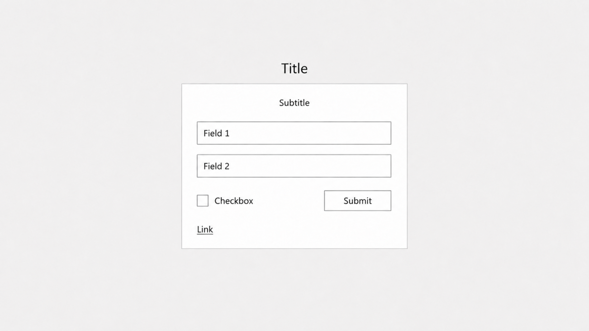

**Screenshots**
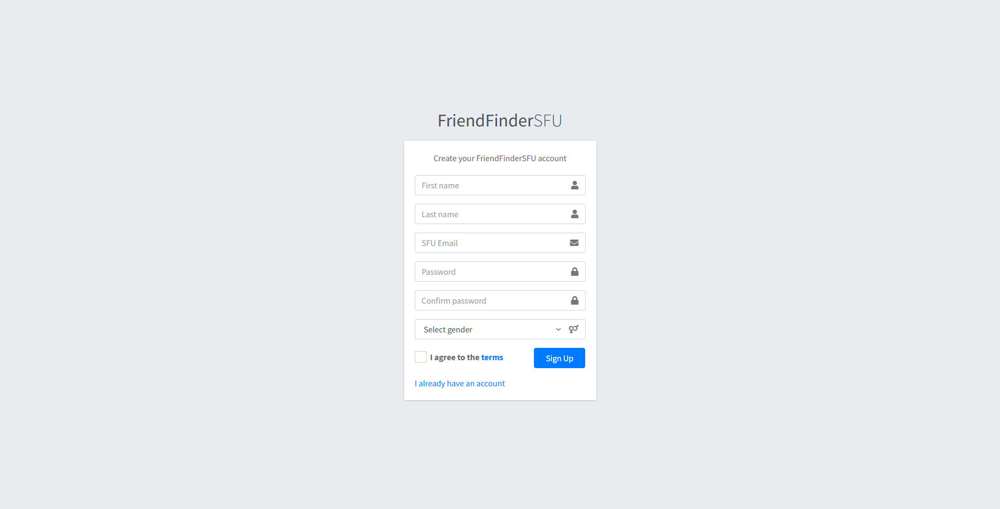
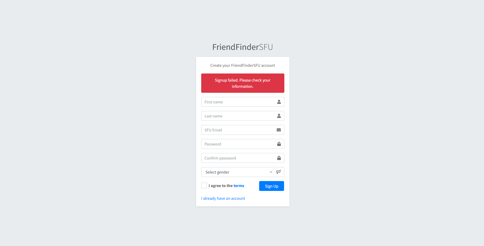

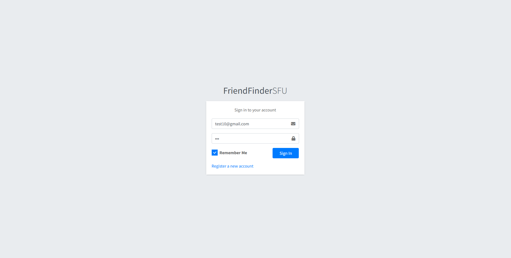
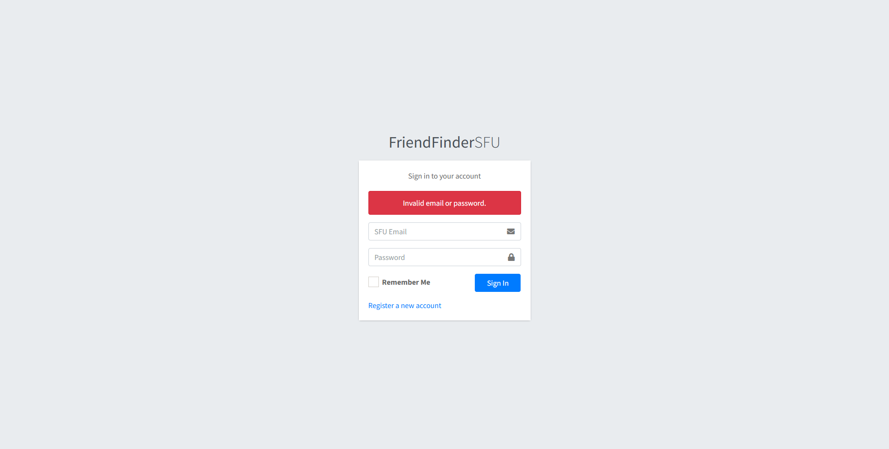

## Dashboard/Landing Page

**Requirements:**
- A menu on the left, displaying navigation items and the user's name
- A menu on the top, displaying a link for logout
- (Admins/Mods only) a notification on the top of the page signifying the user's role and access to the admin panel
- A card (below the item above) containing the user's basic information in a list format and buttons to view their profile or edit their account

**Digital Design Mockup**
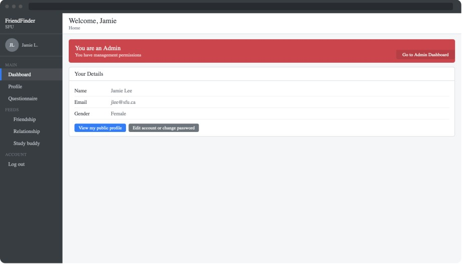

**Screenshots**
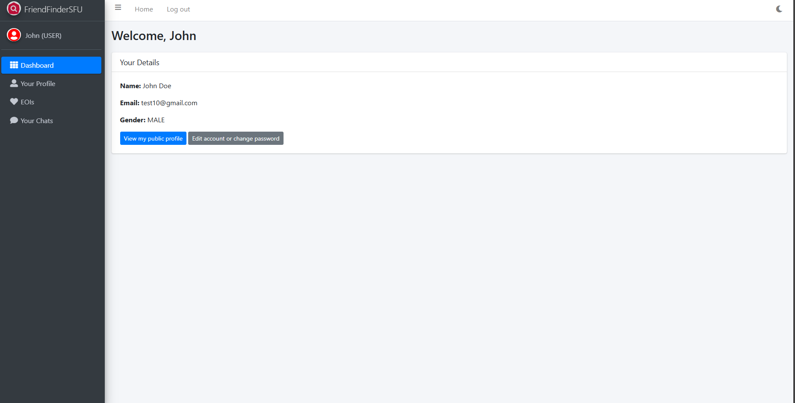
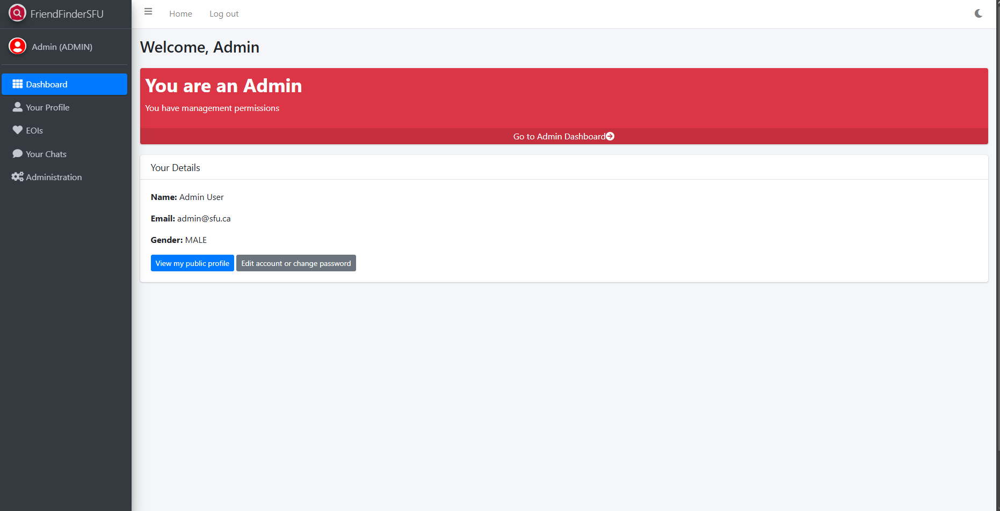

## Tables (Admin Panels/Feeds/ratings page/groups pages)

**Requirements**
- A menu on the left, displaying navigation items and the user's name
- A menu on the top, displaying a link for logout
- (For some pages) a card above the table card, with a title and three columns of form inputs or buttons
- A card containing a title, a headings row, and the table contents in rows

**Digital Design Mockup**
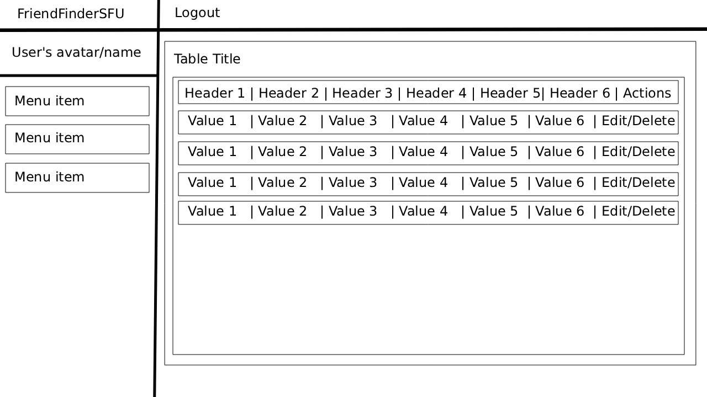

**Screenshots**
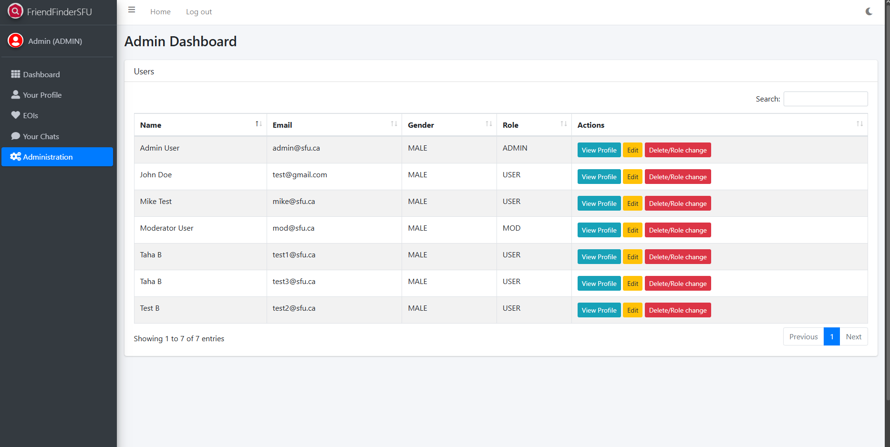
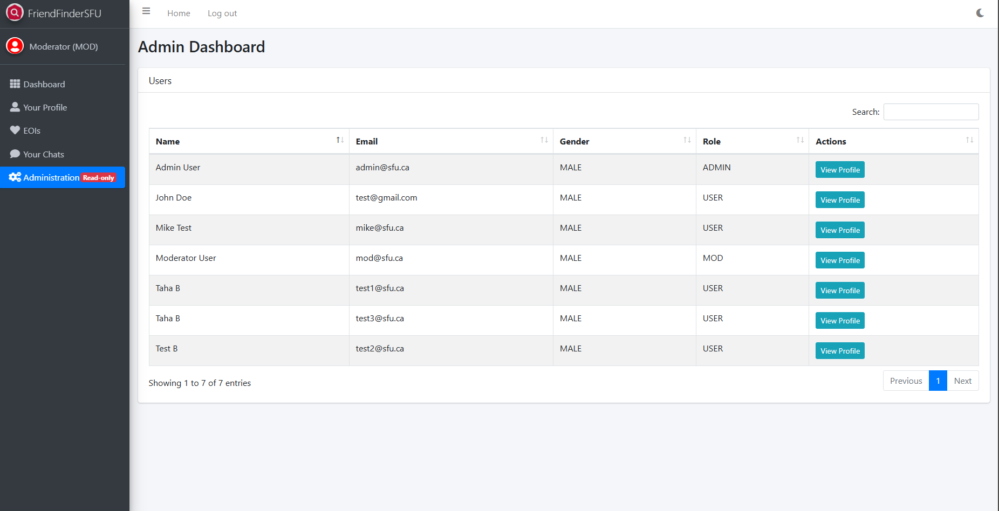

## In-app Forms (questionnairs, edit, admin controls)

**Requirements**
- A menu on the left, displaying navigation items and the user's name
- A menu on the top, displaying a link for logout
- One or more cards in one full-width column, containing a title at the top, a single column of inputs, and buttons/links at the bottom

**Digital Design Mockup**
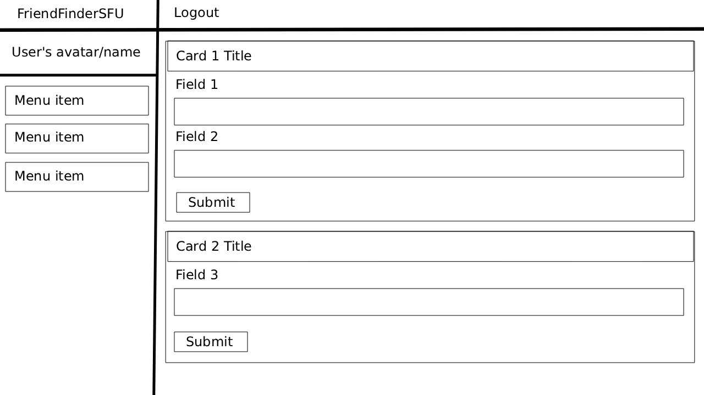

**Screenshots**
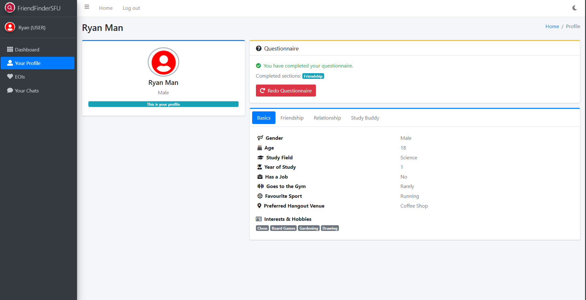

## Chat Page

**Requirements**
- A menu on the left, displaying navigation items and the user's name
- A menu on the top, displaying a link for logout
- A two-column card:
  -  The left column must contain a list of contacts, their avatars (or typography), and their most recent message
  -  The right column must contain a header with the selected contact's name, avatar/typography, a list of messages (with color or position distinctions between messages sent by the user and by the contact), and an input and button for sending new messages at the bottom.

**Digital Design Mockup**
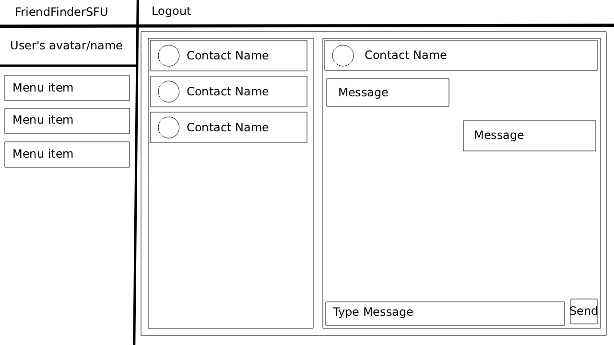

**Screenshots**
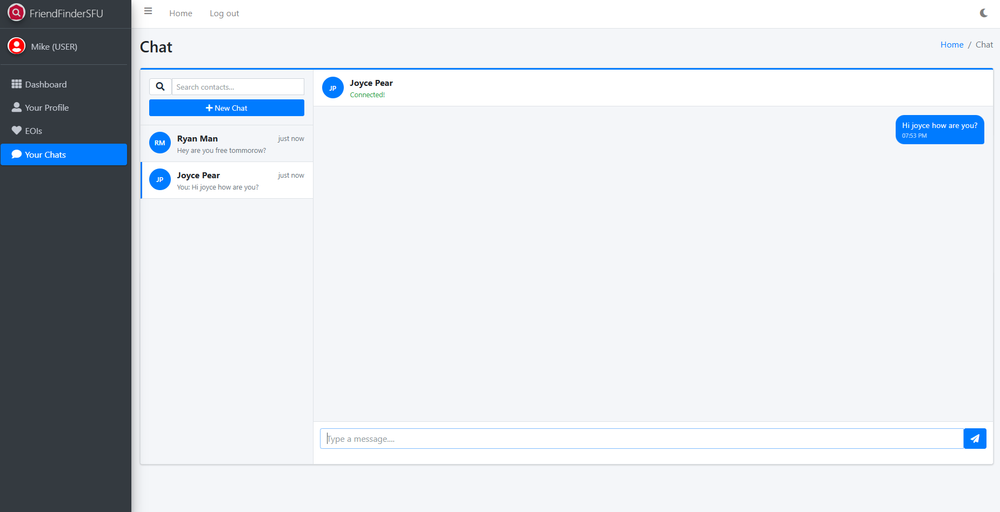

## Profile Page

**Requirements**
- A menu on the left, displaying navigation items and the user's name
- A menu on the top, displaying a link for logout
- A card on the right (width ~1/3), containing the user's name, avatar, gender, match scores to the current user (if applicable), and a dropdown menu and button for sending EOIs
- A card on the left (width ~2/3), containing the user's answers to the questionnair in a list format, in tabs
- (Only if viewing own profile) A card on top of the above card, displaying the user's questionnair status and a button to complete or update their questionnair

**Digital Design Mockups**
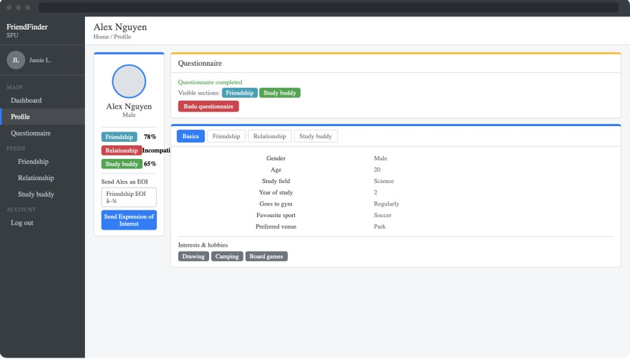

## Group Home Page

**Requirements**
- A menu on the left, displaying navigation items and the user's name
- A menu on the top, displaying a link for logout
- A card with basic group info on the top left of the page
- A banner announcing the existence of chat capabilities, and a button to go to the chat page for the group
- A card with a table of users on the top right of the page, below the chat banner

**Digital Design Mockups**
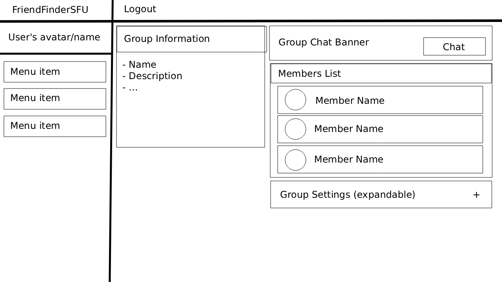

